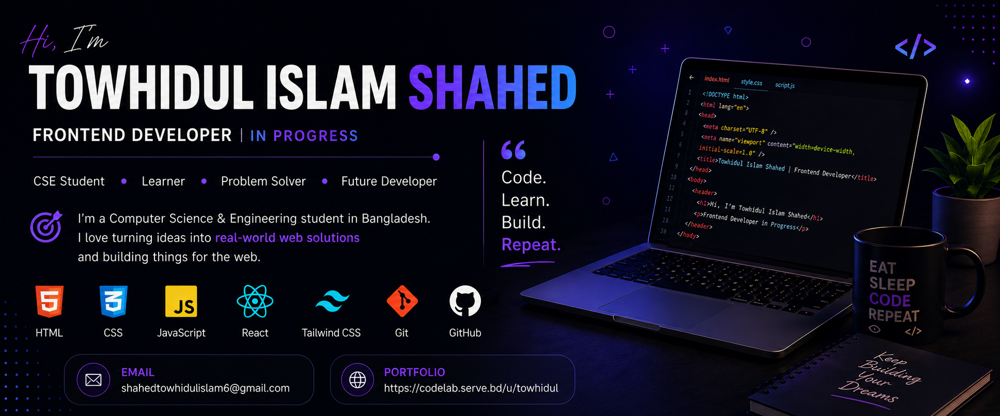

<!-- ====================================================== -->
<!--                    PROFILE BANNER                      -->
<!-- ====================================================== -->

  

<!-- ====================================================== -->
<!--                       INTRO                            -->
<!-- ====================================================== -->

<h1 align="center">
  Hi 👋, I'm Towhidul Islam Shahed
</h1>

  

  💻 CSE Student &nbsp; | &nbsp;
  🌐 Frontend Developer &nbsp; | &nbsp;
  🤖 AI & ML Enthusiast

---

## 👨‍💻 About Me

I'm a Computer Science student passionate about building modern, user-friendly web applications and continuously improving my software engineering skills.

I'm currently focusing on **Frontend Development, React, TypeScript, and modern web technologies**, while also exploring **AI and Machine Learning**.

- 🔭 Currently working on **Frontend Development, AI, and Software Engineering projects**
- 🌱 Currently learning **React, Next.js, TypeScript, Tailwind CSS, and modern frontend development**
- 👯 Looking to collaborate on **open-source projects and web applications**
- 🤝 Interested in **Software Engineering and open-source projects**
- 💬 Ask me about **JavaScript, React, TypeScript, Frontend Development, and AI**
- 📫 Reach me at **shahedtowhidulislam6@gmail.com**
- ⚡ Fun fact: **I enjoy learning new technologies and turning ideas into real-world projects**

---

# 🛠️ Tech Stack

## 🎨 Frontend

  
  
  
  
  
  
  

## ⚙️ Backend & Database

  
  
  
  

## 🤖 AI & Machine Learning

  
  

## 🔧 Tools

  
  
  
  

---

# 🚀 What I'm Working On

- 🌐 Building responsive and modern web applications
- ⚛️ Learning and building projects with React
- 📘 Improving my TypeScript and JavaScript skills
- 🎨 Creating modern interfaces with Tailwind CSS
- 💻 Improving my Software Engineering skills
- 🤖 Exploring practical applications of AI and Machine Learning
- 🌍 Building and deploying real-world projects

---

# 📌 Featured Projects

> 🚀 More projects coming soon!

Currently building projects around:

- 🌐 **Frontend Development**
- ⚛️ **React Applications**
- 💻 **Full-Stack Web Development**
- 🤖 **AI & Machine Learning**

---

# 🌐 Connect With Me

  

  

---
### 📊 GITHUB STATISTICS & ANALYSIS:

<picture>
  <source media="(prefers-color-scheme: dark)" srcset="https://raw.githubusercontent.com/mdsakibdev/mdsakibdev/output/github-contribution-grid-snake-dark.svg">
  <source media="(prefers-color-scheme: light)" srcset="https://raw.githubusercontent.com/mdsakibdev/mdsakibdev/output/github-contribution-grid-snake.svg">
  
</picture>

---

  

---

## 🎯 2026 Goals

- 🚀 Become a professional Full-Stack Web Developer
- ⚛️ Build production-ready React & Next.js applications
- 🖥️ Strengthen Node.js backend development skills
- 🗄️ Improve PostgreSQL and database design skills
- 🧠 Improve problem-solving and algorithmic thinking
- 🌍 Build and deploy real-world projects
- 🤝 Contribute to open-source projects

 <b>Thanks for visiting my profile! 🚀</b> 

 <i>Let's build something amazing together.</i> 

